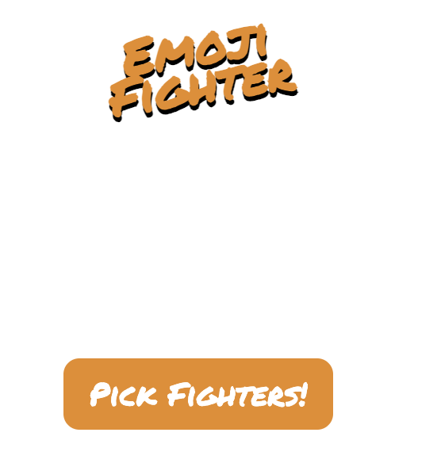
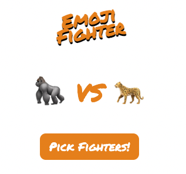

# Emoji Fighter

This project was made for educational purposes but could be applied as a simple component of a game - choose your character, for example. 

When I was teaching, I remember using 'this or that' pictures as good icebreakers and/or conversation starters. They can also be used for workouts (e.g. either do sit ups or push ups). As you can see, there are lots of applications. 

It's totally a throwback to the 90s, I know!

## This is what the landing page looks like

## This is an example of what it looks like once you click on 'Pick Fighters!'

You can click on the 'Pick Fighters!' as many times as you'd like to switch characters. To return to the landing page, simply refresh the browser!

## Special thanks to: 

Per Herald Borgen at Scrimba